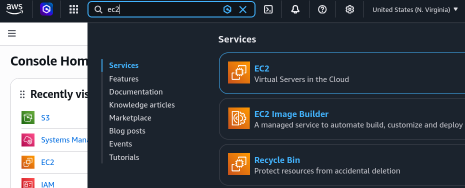
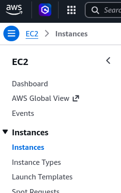
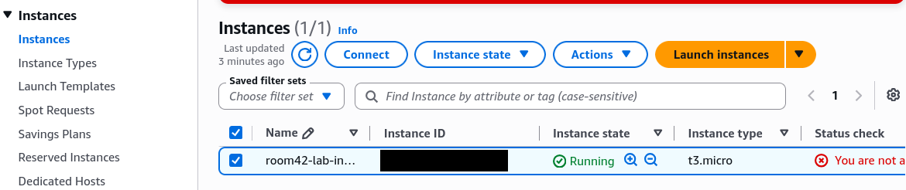
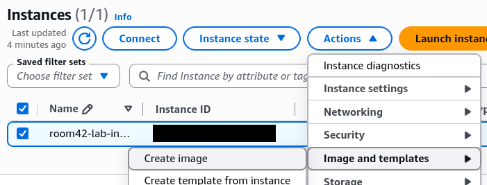
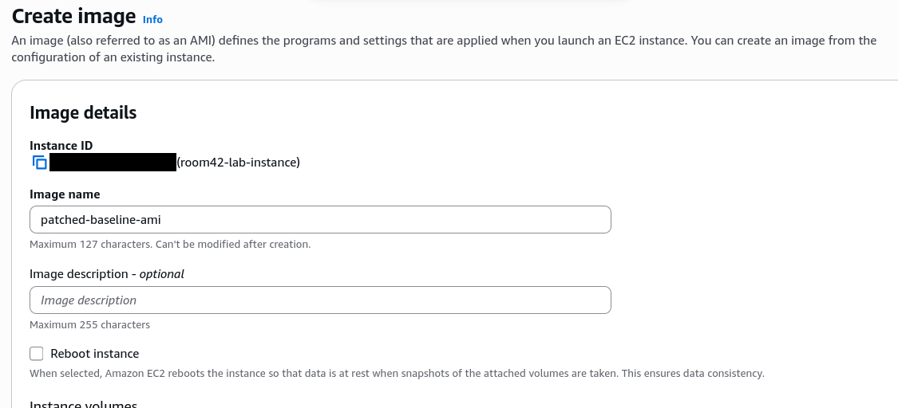
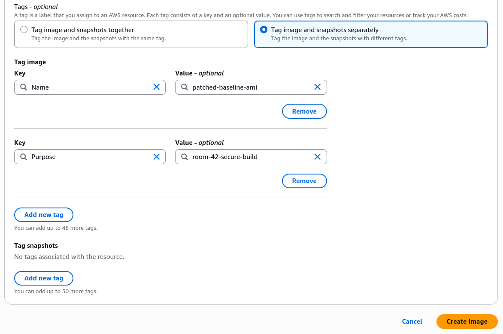
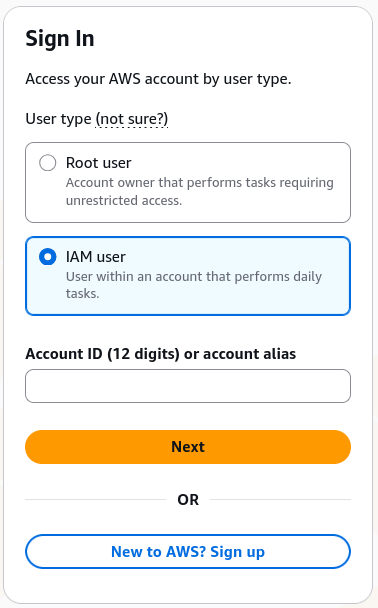
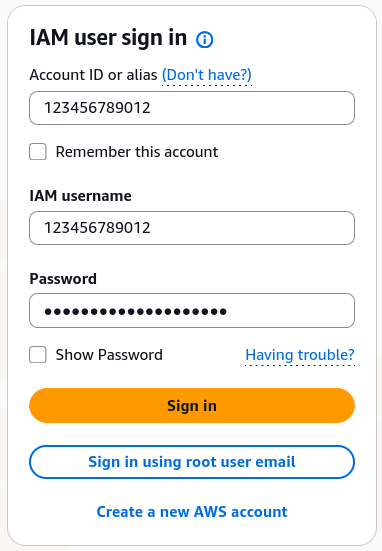
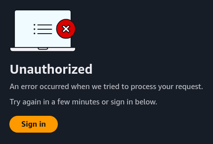

# The Unpatched Instance — TryHackMe Walkthrough

**Difficulty:** medium  
**Date:** 2026-08-15  
**Room:** https://tryhackme.com/room/theunpatchedinstance

> [!WARNING] 
> **Authorized use only** — only ever test systems you are explicitly permitted to test. This material is intended solely for this TryHackMe room on your own lab instance.

## Overview
This room addresses patch debt: the gradual accumulation of missing security updates on long-running EC2 instances that fall outside any maintenance schedule.

It was not possible in task 5 to create an image by using 'aws ec2 create-image' via CloudShell. This walkthrough focuses solely on resolving this limitation of task 5.

## Task 5 'Build It Securely'
### Problem
When trying to execute the given command, it resulted in an 'UnauthorizedOperation' error, as shown below.

```
aws ec2 create-image \
    --instance-id "$INSTANCE_ID" \
    --name patched-baseline-ami \
    --no-reboot \
    --tag-specifications 'ResourceType=image,Tags=[{Key=Name,Value=patched-baseline-ami},{Key=Purpose,Value=room-42-secure-build}]'
```

```
aws: [ERROR]: An error occurred (UnauthorizedOperation) when calling the CreateImage operation: You are not authorized to perform this operation. [...]
```

### Solution
By using the AWS GUI as a workaround, it was possible to create the image by using the following steps.

#### Step 1
Search for 'ec2' in the search bar and click on the EC2 service.



#### Step 2
Select 'Instances'. Ignore any red error pop-ups appearing throughout the following steps.



#### Step 3
Select the instance by checking the box.




#### Step 4

Click on 'Actions', then 'Image and templates', then 'Create image'.




#### Step 5

Enter image details. Use the following fields:

**'Image name'**
```
patched-baseline-ami
```
Ignore **'Image description'**

Make sure **'Reboot instance'** is not checked.

Select **'Tag image and snapshots separately'**.

Create Tag 1
```
Name
```
```
patched-baseline-ami
```
Creae Tag 2
```
Purpose
```
```
room-42-secure-build
```

If it looks something like this (following two screenshots), click 'Create image'.






#### Step 6 (retrieve flag)
Execute the lambda function in CloudShell to retrieve flag.
```
{
    "StatusCode": 200,
    "ExecutedVersion": "$LATEST"
}
{
    "patch_baseline_check": "PASS - custom patch baseline room42-linux-baseline found",
    "ami_check": "PASS - AMI patched-baseline-ami found",
    "status": "PASS",
    "flag": "THM{C****_L*****_S*******}"
}
```


## General Notes

If you are a starter with AWS and the **THM 'Defending AWS'** learning path: After making use of the 'Cloud Details' button in the THM room for getting your credentials, do not use the option 'root user' but the option **'IAM user'** to login. If you see then the **'Unauthorized'** message (screenshot below), which appears from time to time, follow through by clicking the 'Sign in' button. You should now see the AWS dashboard.




I also found that using a private browser window helps avoid the 500 error CloudShell sometimes returns after running commands.
